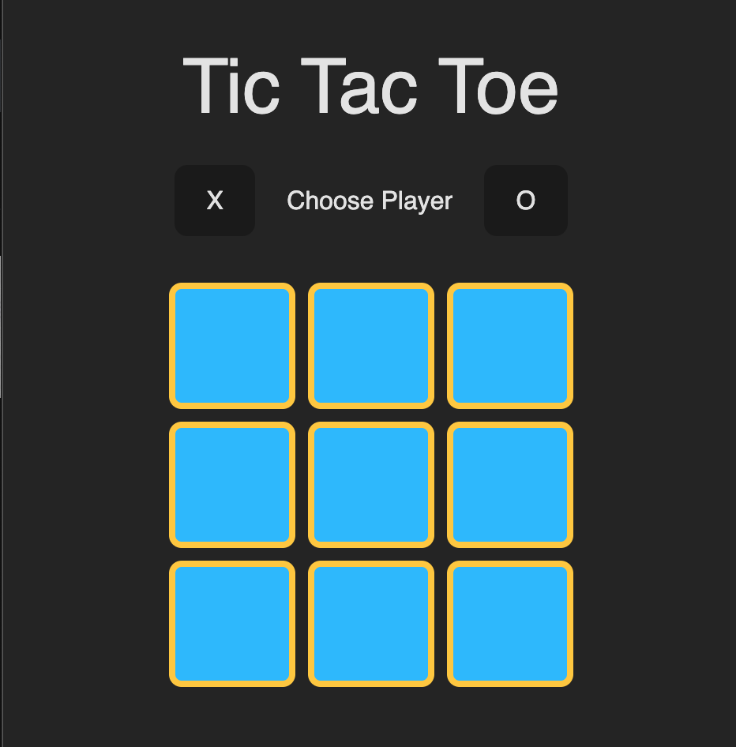

# Tic Tac Toe Game

This project is a simple Tic Tac Toe game I built to try some new frameworks with React, TypeScript, and Vite. It uses Tailwind CSS for styling and ESLint for linting.



## Getting Started

### Prerequisites

Make sure you have the following installed on your machine:

- Node.js (>= 14.x)
- Yarn (>= 1.22.x)

### Installation

1. Clone the repository and install the dependencies.

```bash
git clone git@github.com:CarringtonAllison/tictactoe.git`

yarn install
```

### Start the Game

```
yarn dev
```

### Play The Game

- Choose a Player: At the start of the game, you will be prompted to choose a player (X or O).
- Make a Move: Click on any square on the board to make your move. The game will automatically switch to the other player after each move.
- Win or Draw: The game will detect if there is a winner or if the game is a draw. If there is a winner, an alert will be shown, and you will be prompted to restart the game.
- Restart the Game: Click the "Restart Game" button to reset the board and start a new game.
